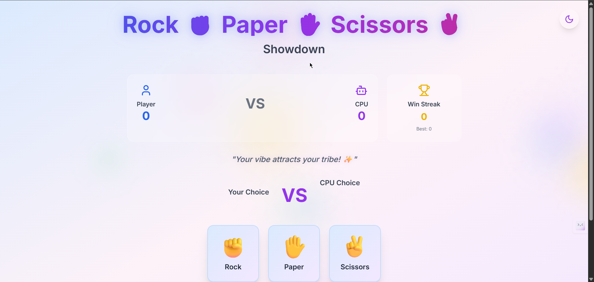

# 🪨📄✂️ Rock Paper Scissors Xtreme

> *The classic game you love, but make it ✨ **aesthetic** ✨*

[](https://choosealicense.com/licenses/mit/)


---

## 🎮 What's This About?

Remember when you used to settle arguments with Rock Paper Scissors? Well, now you can do it in **style**! This isn't your grandma's RPS game – we're talking smooth animations, epic sound effects, confetti explosions, and a UI so clean it could win design awards. 

Perfect for settling debates, killing time, or just vibing with some nostalgic gameplay. Whether you're a casual gamer, a developer looking for inspiration, or someone who just appreciates beautiful interfaces – this one's for you! 🎯

## ✨ Features That Hit Different

- 🎨 **Gorgeous UI/UX** - Dark/Light modes with buttery smooth transitions
- 🎪 **Framer Motion Animations** - Every click feels satisfying AF
- 🎊 **Confetti Celebrations** - Because winning should feel special
- 🔊 **Sound Effects** - Immersive audio feedback (without being annoying)
- 📊 **Smart Scoring System** - Track your wins, streaks, and bragging rights
- 🏆 **Best Streak Tracking** - Local storage keeps your records safe
- 💭 **Dynamic Quotes** - Motivational vibes with every round
- 🌈 **Floating Background Shapes** - Eye candy that doesn't distract
- 📱 **Fully Responsive** - Looks fire on any device
- ⚡ **Lightning Fast** - Built with Vite for optimal performance
- 🎯 **TypeScript** - Type safety because we're professionals here

## 📸 Screenshots

### 🏠 Home Screen


*Clean, modern interface with smooth animations and intuitive controls*

## 🛠️ Tech Stack

This project is built with modern web technologies that developers actually enjoy using:

- ⚛️ **React 18.3.1** - The UI library that rules them all
- 🔷 **TypeScript 5.5.3** - JavaScript but with superpowers
- ⚡ **Vite 7.0.0** - Build tool that's actually fast
- 🎨 **Tailwind CSS 3.4.1** - Utility-first CSS framework
- 🎪 **Framer Motion 10.16.16** - Smooth animations without the headache
- 🎊 **React Confetti 6.1.0** - Because celebrations matter
- 🎯 **Lucide React 0.344.0** - Beautiful, consistent icons
- 🧹 **ESLint** - Code quality that doesn't compromise

## 📦 Installation

Ready to run this beauty locally? Here's how:

### Prerequisites
- Node.js (16+ recommended)
- npm or yarn
- A browser (obviously)

### Quick Start

```bash
# Clone this masterpiece
git clone https://github.com/piyush64-bit/RockPaperSissor.git

# Navigate to the project
cd RockPaperSissor

# Install dependencies
npm install

# Start the development server
npm run dev
```

### Build for Production

```bash
# Create optimized build
npm run build

# Preview the build locally
npm run preview
```

## 🚀 Usage Guide

1. **Choose Your Vibe** 🌙 - Toggle between light and dark modes using the button in the top-right
2. **Make Your Move** ✊✋✌️ - Click on Rock, Paper, or Scissors
3. **Watch the Magic** ✨ - Enjoy the smooth animations and suspenseful reveal
4. **Celebrate Wins** 🎉 - Confetti explosions for victories, motivation quotes for everything
5. **Track Your Progress** 📈 - Keep an eye on your score and win streaks
6. **Repeat & Dominate** 🔄 - Keep playing to beat your best streak!

### Pro Tips:
- 🎵 Enable sound for the full experience
- 🏆 Your best streak is saved locally, so don't clear your browser data!
- 📱 Works perfectly on mobile - great for settling disputes on the go

## 🤝 Contributing

Found a bug? Have a cool feature idea? Want to make the animations even smoother? We love contributions!

### How to Contribute:

1. **Fork the repo** 🍴
2. **Create a feature branch** (`git checkout -b feature/AmazingFeature`)
3. **Commit your changes** (`git commit -m 'Add some AmazingFeature'`)
4. **Push to the branch** (`git push origin feature/AmazingFeature`)
5. **Open a Pull Request** 🎯

### Ideas for Contributions:
- 🎮 Add more game modes (Best of 5, Tournament style)
- 🎨 Create new themes or color schemes
- 🔊 Add more sound effects or music
- 🏆 Add achievements system
- 👥 Multiplayer mode
- 📊 Advanced statistics

## 🧑‍💻 Creator

**Piyush Soni** - *Full Stack Developer & UI/UX Enthusiast*

- 🐙 **GitHub**: [@piyush64-bit](https://github.com/piyush64-bit)
- 💼 **LinkedIn**: [piyush64bit](https://linkedin.com/in/piyush64bit)
- ✉️ **Email**: piiyush.sonii@outlook.com

*Feel free to reach out if you want to chat about code, design, or why Rock always beats Scissors!*

## 📄 License

This project is licensed under the MIT License - see the [LICENSE](LICENSE) file for details.

*TL;DR: Use it, modify it, share it, just don't blame me if you become addicted to playing! 😄*

## ❤️ Love This Project?

If this brought a smile to your face or helped you procrastinate in style:

- ⭐ **Star this repo** - It makes me happy and helps others discover it
- 🐦 **Share it** - Tag your friends who need some RPS in their lives
- 🍕 **Buy me a coffee** - Just kidding, a star is enough!

---

*Made with 💖, lots of ☕, and probably too much attention to detail*

**Thanks for checking out Rock Paper Scissors Xtreme! Now go forth and dominate! 🏆**
